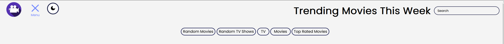
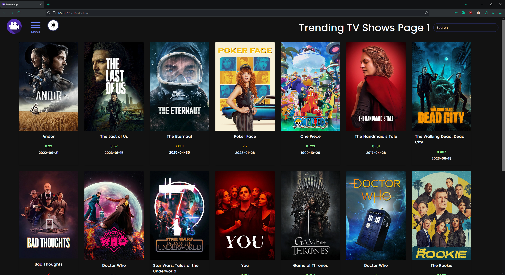
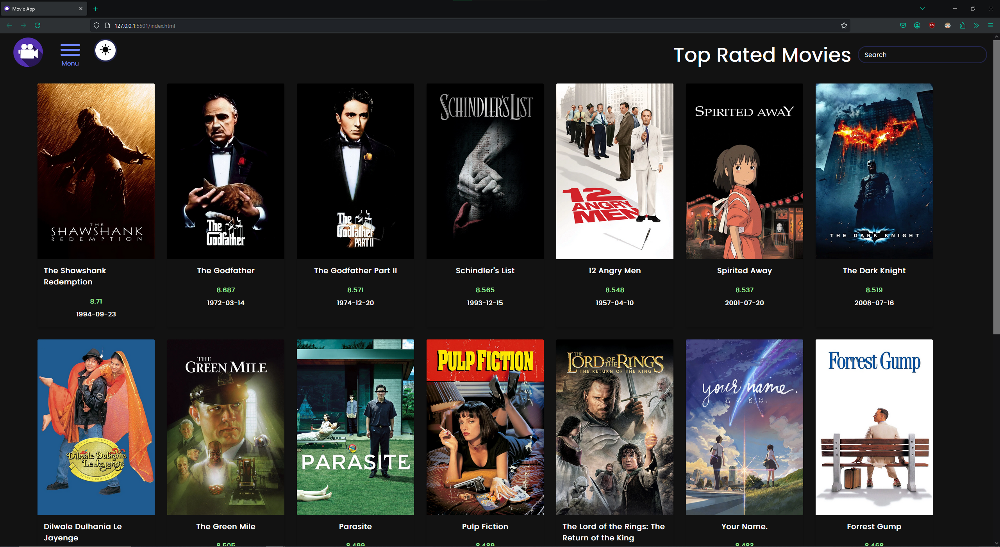

# Getting Started
Run the app on your local server(localhost).

**User will need to provide their own API key from.** https://www.themoviedb.org/?language=en-US

Clicking on the "menu" will display multiple buttons for the user to choose from.

The search bar can be used to look up a specific title, both shows and movies will show that are close to the provided title name.

At the bottom of the page the user can go to the next page by clicking on the "next" button and go to the previous page by clicking on the "prev" button.

Dark mode can be toggled by clicking on the "moon" symbol. 

# Files

* index.html : This file contains the HTML code for the app.
* style.css : This file contains the CSS code for the app.
* script.js : This file contains the JavaScript code for the apps functionality.
* images Folder : This folder contains the images which are used in the README.

API used from: https://www.themoviedb.org/?language=en-US
