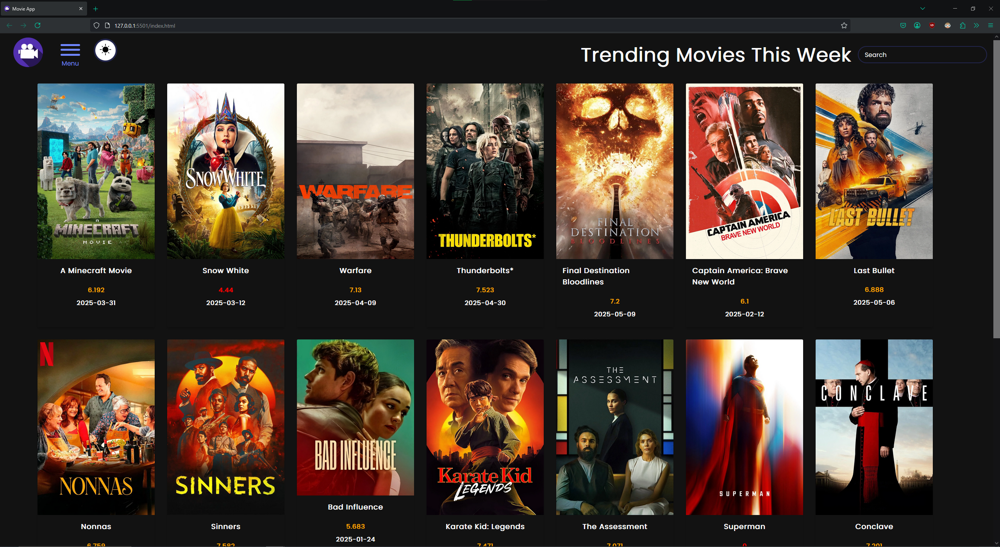

# Getting Started
Run the app on your local server(localhost).\
Clicking on the "menu" will display multiple buttons for the user to choose from.

Api used from: https://www.themoviedb.org/?language=en-US
